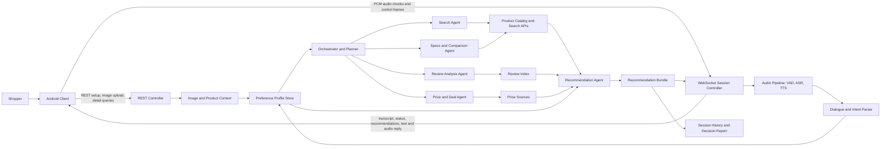

# VoiceShop++

VoiceShop++ is a real-time multimodal shopping copilot. It helps shoppers state a purchase goal naturally, add visual context, retrieve relevant products, compare evidence, and refine recommendations through conversation.

## Getting Started

This repository is currently at the documentation and architecture-design stage. Build and run commands will be added when the Android client and backend service are committed.

Planned direct dependencies:

Frontend:

| Dependency | Purpose |
| --- | --- |
| [Android SDK](https://developer.android.com/studio) | Mobile client runtime, microphone access, image upload, and app packaging. |
| [Kotlin](https://kotlinlang.org/) | Primary Android client language. |
| [Jetpack Compose](https://developer.android.com/compose) | Planned declarative UI framework for the shopping conversation interface. |
| [OkHttp](https://square.github.io/okhttp/) | WebSocket audio streaming and REST API calls from the client. |
| [Kotlin Coroutines](https://kotlinlang.org/docs/coroutines-overview.html) | Asynchronous audio capture, network streaming, and UI state updates. |

Backend:

| Dependency | Purpose |
| --- | --- |
| [Python](https://www.python.org/) | Backend service and model orchestration language. |
| [FastAPI](https://fastapi.tiangolo.com/) | REST endpoints and WebSocket session controller. |
| [Uvicorn](https://www.uvicorn.org/) | ASGI server for the FastAPI backend. |
| [Pydantic](https://docs.pydantic.dev/) | Request, response, and internal engine data models. |
| [OpenAI API](https://platform.openai.com/docs/) | ASR, LLM dialogue/reasoning, and multimodal product understanding. |
| [ElevenLabs API](https://elevenlabs.io/docs) | Streaming text-to-speech voice responses. |
| [SerpAPI](https://serpapi.com/) | Fallback product search over Google Shopping results. |
| [Deepgram API](https://developers.deepgram.com/) | Optional streaming ASR provider if lower-latency voice recognition is needed. |

## Model and Engine

### Story Map

VoiceShop++ targets shoppers who face information overload when buying information-heavy products such as laptops, phones, cameras, appliances, and other high-value goods. The product goal is to turn scattered product pages, reviews, prices, and specifications into a smaller set of actionable, explainable choices.

The primary persona is Mia, a student or young professional buying a laptop for design work. Mia wants to describe her needs conversationally, optionally add a product image or screenshot, receive recommendations with evidence, refine the shortlist through follow-up dialogue, and reach a confident purchase decision.

### Release Tiers

| Tier | Definition |
| --- | --- |
| Skeletal Product | Proves the end-to-end thesis: accept a shopping need, build a structured preference profile, retrieve candidates from a controlled source, and show a ranked recommendation with concise reasons. |
| MVP | Supports realistic shopping tasks with voice-first interaction, multimodal context, multi-agent search and review analysis, preference refinement, explainable comparison, and a usable interface. |
| Stretch Goals | Adds true full-duplex interaction, privacy-preserving memory, cross-retailer retrieval, cart/checkout handoff, price monitoring, and self-improving agent workflows. |

### User Value Flow

| Stage | User Goal | Skeletal Product | MVP | Stretch Goals |
| --- | --- | --- | --- | --- |
| 1. Start session and state need | Open the app and describe the shopping mission naturally. | Session creation, typed or recorded query input, transcript display. | VAD, ASR, LLM dialogue manager, and TTS voice output. | Full-duplex barge-in and proactive greeting from remembered preferences. |
| 2. Capture preferences | Convert messy user language into structured shopping requirements. | Intent parser and preference profile. | Clarification strategy, correction handling, and uncertainty flags. | Long-term preference memory and personalized defaults. |
| 3. Add visual context | Upload or reference a product image, style example, or product page. | Optional image upload stored with the session. | Image-based search and product-page understanding. | Live camera or screen sharing for real-time visual shopping. |
| 4. Plan and retrieve | Search for products, prices, specs, and review evidence without manual research. | Basic product search agent over a controlled catalog or fixture. | Planner, Search, Review Analysis, Specs/Comparison, Price/Deal, and Recommendation agents. | Cross-retailer retrieval, deal tracking, trust scoring, and source credibility checks. |
| 5. Compare and recommend | Receive a small ranked set of products with clear reasons. | Recommendation cards with price, key specs, and fit rationale. | Evidence-backed top-three ranking with pros, cons, tradeoffs, and source labels. | Interactive what-if optimization and multi-objective ranking controls. |
| 6. Refine through follow-up dialogue | Ask follow-up questions, interrupt, change constraints, and receive updated recommendations. | Text follow-up Q&A within the same session. | Dynamic profile update and re-ranking after preference changes. | Continuous streaming updates while the assistant is speaking. |
| 7. Decide and act | Move from recommendation to confident purchase decision. | Product detail summary and external product link. | Final comparison summary, risk checklist, and save/share decision report. | Smart cart, checkout handoff, price alerts, and purchase timing advice. |
| 8. Learn and protect preferences | Preserve useful context while respecting privacy. | Session-only summary. | Explicit opt-in preference memory and deletion controls. | On-device privacy layer, self-evolving workflow library, and feedback-based agent improvement. |

### Consolidated Feature Sets

Skeletal Product:

- Session creation and typed or recorded shopping-need intake.
- Basic transcript display and correction.
- Intent parsing into a structured preference profile.
- Clarifying question generation for missing critical fields.
- Basic product search over a controlled catalog or product fixture.
- Simple top-product recommendation cards with price, specs, and fit rationale.
- Text follow-up Q&A within the same session.
- Final session summary and product-detail link or handoff.

MVP:

- Voice-first conversation pipeline using VAD, ASR, LLM dialogue management, and TTS.
- Robust preference updates for corrections, new constraints, and follow-up questions.
- Image-based product discovery and product-page understanding.
- Multi-agent shopping pipeline with Planner, Search, Review Analysis, Specs/Comparison, Price/Deal, and Recommendation agents.
- Evidence-backed top-three recommendations with pros, cons, tradeoffs, and source labels.
- Dynamic re-ranking when user preferences change.
- Saveable decision report and final comparison summary.
- Explicit opt-in preference memory and user-controlled deletion.

Stretch Goals:

- True full-duplex speech interaction with natural interruption handling and streaming response revision.
- Live camera or screen-sharing context for real-time visual shopping assistance.
- Cross-retailer open-web retrieval with credibility, freshness, and price-history scoring.
- Agentic cart management, checkout handoff, deal monitoring, and price alerts.
- Privacy-preserving or on-device speech, preference, and memory components.
- Self-evolving workflow library based on reflection over user feedback and agent outcomes.
- Collaborative shopping support, shared decision reports, and group preference negotiation.

### Acceptance Criteria Summary

Skeletal Product feature: Conversational Need Intake and Structured Preference Profile.

- Given a valid shopping request, the engine creates or updates a session-specific preference profile and preserves the raw input as evidence.
- For "I need a lightweight laptop for design work with good battery under $1500", the returned profile must include category `laptop`, use case `design work`, budget ceiling `$1500`, soft preferences including lightweight and battery life, and no unsupported hard constraints.
- If category, budget, or primary use case is missing, the engine marks it unknown and returns one concise clarification question.
- If the user corrects a prior statement, the new value supersedes the old value while preserving revision history.
- Hard constraints and soft preferences must be separated.
- The result must be machine-readable for downstream search without re-parsing free-form text.
- Done means unit tests cover successful extraction, missing-field clarification, correction handling, and no-hallucination behavior on at least ten representative shopping prompts.

MVP feature: Evidence-Backed Multi-Agent Recommendation and Dynamic Refinement.

- The Planner Agent must create a task plan that invokes product search, specification comparison, review analysis, and recommendation synthesis; price checking is invoked when price data is available.
- Given enough products, the engine returns exactly three ranked recommendations with product name, price or unavailable flag, relevant specs, strengths, weaknesses, and a fit explanation.
- Products violating hard constraints are excluded, and removed candidates include a brief reason.
- Review-derived claims are grounded in review evidence or labeled low-confidence.
- New constraints trigger profile update, re-ranking, and an explanation of what changed.
- Excluded products do not remain in the top-three unless the conflicting constraint is later removed.
- User-facing responses put the top recommendation first, summarize alternatives, and invite follow-up.
- Done means an integration test demonstrates the path from profile to top-three recommendations, then verifies ranking changes after at least one follow-up preference change.

### Engine Architecture



### Engine Blocks

| Block | Implementation plan |
| --- | --- |
| Android Client | Captures microphone audio, sends roughly 100 ms PCM chunks over WebSocket, sends control frames for start/end/interrupt, uploads images over REST, renders transcript, recommendation cards, and streamed audio replies. |
| REST Controller | Creates and deletes sessions, accepts image uploads, exposes product details, reviews, user preferences, and session history. It also returns the WebSocket URL for the active conversation session. |
| WebSocket Session Controller | Maintains the real-time session. It receives audio/control frames, forwards audio to the audio pipeline, streams partial/final transcripts, emits agent status, sends recommendation updates, and supports user interruption. |
| Audio Pipeline | Uses VAD to detect speech boundaries, ASR to convert speech to text, and TTS to stream voice replies back to the client. The MVP can be turn-based; stretch work adds true full-duplex barge-in. |
| Dialogue and Intent Parser | Converts raw utterances into structured intents and preference updates. It separates hard constraints from soft preferences and asks clarification questions for missing critical fields. |
| Preference Profile Store | Holds session-specific category, use case, budget, constraints, preferences, image context, accepted/rejected products, and revision history. MVP memory is explicit opt-in. |
| Orchestrator and Planner | Converts the current intent/profile into a task plan, runs independent agents in parallel where possible, tracks dependencies, and merges results into a recommendation request. |
| Search Agent | Retrieves candidate products from a controlled catalog for the Skeletal Product and from product/search APIs for later releases. It filters hard constraints before ranking. |
| Review Analysis Agent | Aggregates reviews into evidence-backed pros, cons, aspect scores, and warnings. Low-volume or missing evidence is surfaced as low confidence. |
| Specs and Comparison Agent | Compares relevant product attributes such as CPU, GPU, memory, storage, display, battery life, weight, warranty, and platform compatibility. |
| Price and Deal Agent | Checks current price and, when available, price history or deal signals. It flags price-unavailable states rather than blocking recommendations. |
| Recommendation Agent | Synthesizes product candidates, profile data, specs, reviews, and price signals into a ranked recommendation bundle with explanations and excluded-candidate reasons. |
| Session History and Decision Report | Stores session summaries, the final shortlist, selected product, tradeoffs, risk checklist, and optional shareable decision report. |

## APIs and Controller

The frontend communicates with the engine through REST for setup/non-real-time resources and WebSocket for real-time conversation.

### WebSocket Realtime Protocol

Endpoint:

```text
wss://api.voiceshop.com/ws/session/{session_id}
```

Client to server:

| Message | Type | Description |
| --- | --- | --- |
| Raw PCM audio chunk | Binary | 16 kHz mono PCM audio, sent about every 100 ms during speech. |
| `{"type":"audio_start"}` | JSON | Marks the beginning of a user turn. |
| `{"type":"audio_end"}` | JSON | Marks explicit end of user speech; VAD may also infer this. |
| `{"type":"interrupt"}` | JSON | Stops current TTS/reply generation and lets the user revise the turn. |
| `{"type":"image_ref","image_id":"img_123"}` | JSON | Attaches an uploaded image to the current conversation turn. |
| `{"type":"text","content":"cheaper one"}` | JSON | Text fallback input for typed follow-up or ASR fallback. |

Server to client:

| Message | Description |
| --- | --- |
| `transcript.partial` | Intermediate ASR text while the user is speaking. |
| `transcript.final` | Final ASR text for the current turn. |
| `intent` | Parsed intent and slots, such as `search_product` with budget/use-case filters. |
| `agent.status` | Progress updates from planner/search/review/recommendation agents. |
| `reply.text.delta` | Streaming natural-language response text. |
| `reply.audio.chunk` | Base64-encoded streaming TTS audio chunk with sequence number. |
| `recommendations` | Current ranked product result array. |
| `turn.end` | Marks completion of the current assistant turn. |
| `error` | Error code and message, such as `ASR_TIMEOUT`. |

### REST API

| Method | Endpoint | Purpose | Response |
| --- | --- | --- | --- |
| `POST` | `/api/v1/session` | Create a shopping session before opening the WebSocket. | `{ "session_id": "...", "ws_url": "..." }` |
| `DELETE` | `/api/v1/session/{id}` | End an active session and release session resources. | Empty success response or final session summary. |
| `POST` | `/api/v1/image` | Upload an image for visual search or product-page context. | `{ "image_id": "img_123" }` |
| `GET` | `/api/v1/products/{id}` | Fetch product details for a selected recommendation. | Product detail object. |
| `GET` | `/api/v1/products/{id}/reviews` | Fetch review summary and evidence for a product. | Review summary object. |
| `GET` | `/api/v1/preferences` | Read stored user preferences when the user has opted in. | Preference profile. |
| `PUT` | `/api/v1/preferences` | Update saved preferences such as budget, brand, use case, or privacy settings. | Updated preference profile. |
| `GET` | `/api/v1/history` | Fetch previous sessions, shortlists, compared products, and decision reports. | Session history list. |

Typical flow:

1. The client calls `POST /api/v1/session` and receives `session_id` and `ws_url`.
2. The client opens the WebSocket and streams audio plus JSON control frames.
3. The server streams transcript, intent, agent progress, text, audio, and recommendations.
4. The client uses REST for image upload, product detail pages, review summaries, preferences, and history.
5. The client closes the session through `DELETE /api/v1/session/{id}` when the shopping task ends.

### Internal Engine Interfaces

```python
def build_preference_profile(
    session_id: str,
    user_input: str,
    prior_profile: PreferenceProfile | None = None
) -> PreferenceProfileUpdate:
    """Return category, use case, budget, hard constraints, soft preferences,
    unknown critical fields, clarification question, evidence spans, and revision history."""

def parse_intent(utterance: str, context: SessionContext) -> Intent:
    """Return a structured intent such as search, compare, filter, checkout, or chitchat."""

def plan(intent: Intent, context: SessionContext) -> Plan:
    """Return agent tasks, dependencies, and execution order."""

def search_products(query: SearchQuery) -> list[Product]:
    """Retrieve and rank products by keyword, filters, and optional image context."""

def analyze_reviews(product_ids: list[str], aspects: list[str]) -> ReviewSummary:
    """Aggregate review evidence into pros, cons, and aspect scores."""

def generate_recommendation_bundle(
    profile: PreferenceProfile,
    visual_context: VisualContext | None,
    catalog_source: ProductCatalog,
    review_source: ReviewIndex,
    price_source: PriceIndex | None
) -> RecommendationBundle:
    """Return ranked products, evidence, pros/cons, tradeoffs, ranking rationale,
    excluded-candidate reasons, data-quality warnings, and user-facing summary."""
```

## Third-Party SDKs

| Service or SDK | Used by | Planned interaction |
| --- | --- | --- |
| [OpenAI Audio API](https://platform.openai.com/docs/guides/audio) | Backend audio pipeline | Convert user speech to transcript when not using a dedicated streaming ASR provider. |
| [OpenAI Responses API](https://platform.openai.com/docs/api-reference/responses) | Dialogue, planning, recommendation, multimodal reasoning | Parse intent, summarize evidence, synthesize recommendations, and understand uploaded images. |
| [ElevenLabs Text to Speech API](https://elevenlabs.io/docs/api-reference/text-to-speech) | Backend audio pipeline | Stream spoken assistant responses to the client. |
| [SerpAPI Google Shopping API](https://serpapi.com/google-shopping-api) | Search Agent | Retrieve product candidates from Google Shopping as a fallback or broader search source. |
| [Deepgram Streaming API](https://developers.deepgram.com/docs/streaming) | Optional backend audio pipeline | Provide lower-latency streaming ASR if needed. |
| [OkHttp WebSocket](https://square.github.io/okhttp/5.x/okhttp/okhttp3/-web-socket/) | Android client | Maintain the realtime session connection and send binary audio frames. |

## View UI/UX

## Team Roster

| Member | Initial technical ownership |
| --- | --- |
| Yutong Wang | Collaborative AI agent systems |
| Yutong Cai | Agent implementation |
| Ying Feng | Backend development |
| Yizhou Li | Scalable AI infrastructure |
